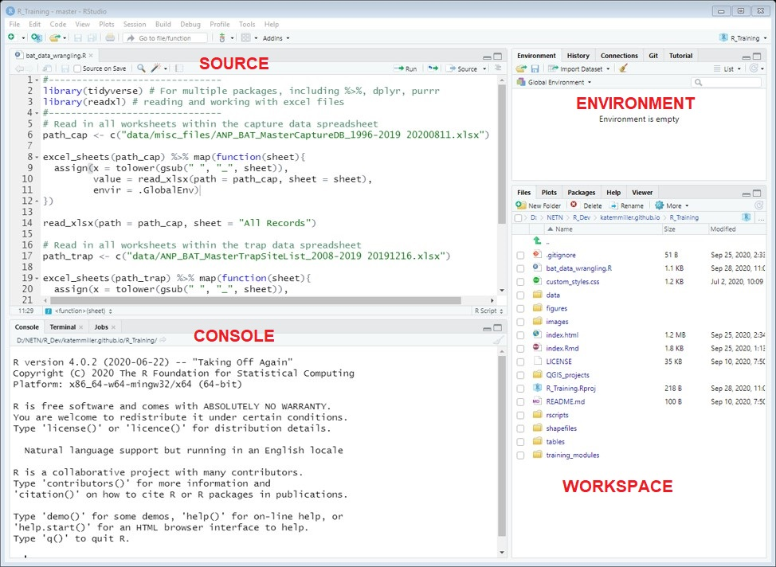

#### Intro to R & RStudio{.tabset}

<details open><summary class='drop'>Introduction to R and RStudio</summary>
R is a programming language and free software environment that was developed by statisticians for statistical computing and graphics. It has since grown to fill many needs beyond statistics and graphing, but is still one of the leading programming languages for non-ML statistics and data visualization. For more information on the history of R, visit the <a href="https://www.r-project.org/about.html"> R Project website</a>. 

RStudio is an integrated development environment (IDE) that is a shell around the R program. RStudio makes programming in the R language way easier by color coding different types of code, checking code as you type, and providing many useful tools with the push of a button or key stroke (eg viewing help info). When you open RStudio, you typically see 4 panes:



<ul class="disc">
  <li><b>Source:</b> This is typically the top left pane, and is where you can load and write scripts. In the photo above, we have a bat_data_wrangling.R script loaded. Note that if you haven't yet loaded or started a new script, you won't see this pane until you do. When you're ready to run the scripts you can either highlight a line or lines and click "Run" or press <b>Ctrl+Enter</b>. That essentially sends the code to R (which lives in the 
  console directly below), and you'll typically see some form of output in the console.</li>
    <ul class="square">
    <li>RStudio color codes functions, datasets, quoted strings, numbers, comments, etc. differently to make code easier to read. You can customize the layout and appearance of your code by clicking on <b>Tools > Global Options > Appearance</b>. For example, I prefer a dark 
    background, and use the Cobalt Editor Theme. Using that theme, comments are blue, numbers are magenta, quoted
    strings are green, etc.</li>
    <li>RStudio also checks your code and updates the colors as you go. If, for example, you have an unclosed parentheses pair in your code, 
    you will see Xs to the left of the line number and sometimes a little squiggle under a word. If you missed a closing quote, it will 
    turn all of your following code the color of text (green in my case) until you close the quote. This makes it easier to spot where you
    missed the closing quote.</li>
    </ul>
  <li><b>Console:</b> The pane in the bottom left is essentially where R lives. When you first open RStudio, the console will tell you the
  version of R that you're running under the hood (should be R 4.0.2 -- "Taking Off Again" or R 4.0.3 -- "Bunny-Wunnies Freak Out" for our training). You can type code directly in the console, or you can write scripts and send the code to
  the console. Note that the console color codes errors where code failed differently than warnings or successful runs of code. </li>
  <li><b>Environment Window:</b> This pane in the top right shows you the objects loaded in your environment, like datasets, that are accessible to you by name. You can also click on objects and view them.</li>  
    <ul class="square">
    <li>The history tab in this pane shows the code you've run in the current session, and can be a way to recover lines you ran 
    but deleted/overwrote and later realized you needed in your script. I rarely go here, but it's really saved me
    before!</li>
    <li>The Tutorial tab is relatively new. I haven't used it much, but is worth checking out.</li>
    </ul>
  <li><b>Workspace:</b> the pane in the bottom right has multiple useful tabs.    
    </li>
    <ul class="square">
    <li><i>Files:</i> This tab shows the files within your working directory. You don't need to type a full file path to access these files.</li>
    <li><i>Plots:</i> This tab will show plots that you create.</li>
    <li><i>Packages:</i> Tab allows you to turn on/off packages, and also view the help files within each package. You can also do that with code.</li>
    <li><i>Help:</i> Allows you to search for help within packages that have been installed on your computer</li>
    </ul>
</ul>
</details>
<br>
<details open><summary class='drop'>Useful keystrokes</summary>
Once you get in the swing of coding, you'll find that minimizing the number of times you have to use your mouse will help you code faster. RStudio has done a great job creating lots of really useful keyboard shortcuts designed to keep your hands on the keyboard instead of having to click through menus. One way to see all of the shortcuts RStudio has built in is to press <b>Alt+Shift+K</b>. A window should appear with a bunch of shortcuts listed. These are also listed on <a href="https://rstudio.com/wp-content/uploads/2016/01/rstudio-IDE-cheatsheet.pdf">RStudio's IDE Cheat Sheet</a>. The shortcuts I use the most often are listed below:
<ul><li>UNDO: Ctrl+Z</li>
<li>REDO: Ctrl+Y</li>
<li>Run highlighted code: Ctrl Enter</li>
<li>Restart R Session: Ctrl Shift F10</li>
<li>Move mouse to Source pane: Ctrl 1</li>
<li>Move mouse to Console pane: Ctrl 2</li>
<li>Insert pipe (%>%): Ctrl Shift M</li>
<li>Insert "<-" : Alt - </li> 
<li>Zoom in to make text bigger: Ctrl Shift + </li>
<li>Zoom out: Ctrl - </li>
<li>Clear console: Ctrl L </li>
<li>Duplicate line of code: Ctrl Shift D</li>
<li>Move line of code up or down: Alt arrow up or down</li>
</ul>
</details>
</br>
<details open><summary class='drop'>Global Options</summary>
There are several settings in the Global Options that everyone should check to make sure we all have consistent settings. To check these settings, go to <b>Tools > Global Options</b> and follow the steps below. 

<ol>
<li>Under the General tab, you should see that your R Version is [64-bit] and the version is R-4.0.2 or R-4.0.3. If it's not, you need to change it to that. </li>
<li>Make sure you are not saving your history. When R saves your history, you start with the same workspace (including data loaded in the global environment), which seems like a good thing. However, the whole point of using R is that your code should return the same results every time you run it. Clearing your history every time you close RStudio forces you to test that your code is still returning the same results. If you happen to be working with huge datasets that take awhile to load and process, saving your history and RData may be useful. Otherwise, clear your history by default by making sure <i>Always save history (even when not saving .RData)</i> is not checked. </li>
<li>Also make sure the <i>Restore .RData into your workspace at startup</i> is unchecked. If you ever need to do that, you can run 1 line of code instead (load.Rdata("filename.Rdata")). </li>
<li>Most other settings are whatever you prefer, including everything in the Appearance window.</li></ol>   
</details>
</br>
<details open><summary class='drop'>Loading dependencies</summary>
While base R (everything that comes with the installation from CRAN) comes with a lot of useful functions, there are also a lot of great packages (aka libraries) out there that make data wrangling, analysis and plotting easier and more efficient. The packages we will rely on the most during this training are: 
<ul>
  <li><i>dplyr:</i> data wrangling functions including filtering (subsetting), arranging, and summarizing</li>
  <li><i>tidyr:</i> reshaping data from long to wide and vice versa</li>
  <li><i>ggplot2:</i> the most widely used package for plotting in R</li>
  <li><i>rgdal:</i> to set coordinate systems and to load or create shapefiles</li>
  <li><i>devtools:</i> required to install packages from github, including the ones listed below.</li>
</ul>
Note that <i>dplyr</i> <i>ggplot2</i> and <i>tidyr</i> are part of the <i>tidyverse</i>, which is a collection of a lot of really useful packages that are designed to work with a specific format of data and have similar function structures that allow you to chain processes together (more on that later). Instead of only installing <i>dplyr</i> and <i>tidyr</i> individually, I recommend installing and loading the <i>tidyverse</i>, which will load those packages, along with several other useful packages.

There are also a number of packages NETN or collaborators have built to work with the monitoring data we're collecting, including: 
<ul>
  <li><i>forestNETN:</i> for importing, filtering, and summarizing forest data specific to NETN</li>
  <li><i>NCRNWater:</i> for importing, filtering, and summarizing water data collected by NETN (initially developed by National Capital Region Network)</li>
  <li><i>wetlandACAD:</i> for working with water level data collected in ACAD sentinel wetlands</li>
</ul>

<p class='code'><b>If you haven't already installed these packages </b>(directions are also in the Prep for Training tap), run the code chunk below:</p>

</ul>

```{r orgD1M1, echo=F, eval=F, include=F}
#--------------------
#    Day 1 Mod 1
#--------------------
```

```{r, c1, echo=T, eval=FALSE}
install.packages(c("tidyverse", "rgdal", "devtools"))
devtools::install_github("katemmiller/forestNETN")
devtools::install_github("NCRN/NCRNWater")
```

You only need to run the previous code chunk once. After these packages are installed, you can just load them via library(package_name). A couple of notes about packages.
<ul>
  <li>Best practices for writing code are to load all of the packages you will use at the top of the script, so that it's obvious to another user if they need to install a package to make the code work.</li> 
  <li>You only need devtools to install the NETN-specific packages from github. Once the NETN-specific packages are installed (eg forestNETN), you don't need to load devtools again.</li>
  <li>The tidyverse and rgdal can take awhile to install, but once they're installed they're relatively quick to load.</li>
  <li>Note the use of :: in the code chunk above. That's another way to use functions in a package without loading the package. I only use this for packages like devtools, which I only use once in a script and I use it early. The :: symbol also comes in handy if you happen to be using a function where multiple packages have the same named function. For example, <u>filter</u> is a named function in the base R <i>stats</i> package and in <i>dplyr</i>. If you want the filter function from dplyr, type dplyr::filter.</li>
  <li>To install a package, the name needs to be in quotes. To load the package via library(), you don't quote the package name. Don't ask me why...</li>
</ul>

<p class='code'>To load the packages, run the code chunk below:</p>
```{r, c2, echo=T, results='hide', message=FALSE, eval=FALSE}
library(tidyverse)
library(rgdal)
library(forestNETN)
library(NCRNWater)
```

```{r, c2c, echo=F, results='hide', message=FALSE}
library(tidyverse)
library(rgdal)
```

If you get an error that says there is no package called "x", it means that package didn't install properly, and you should try installing the package again. 

If you run into issues installing from GitHub (eg using install_github function), here are a couple of tips for troubleshooting: 
<ol>
<li>Install Rtools for Windows 64-bit. The download page is <a href="https://cran.r-project.org/bin/windows/Rtools/">here.</a></li> 
  <ol style="list-style-type:upper-alpha">
  <li>Download the <a href="https://cran.r-project.org/bin/windows/contrib/4.0/backports_1.1.10.zip">Windows Binaries</a> for backports.</li>
  <li>Install backports from file in RStudio by going to <i>Tools> Install Packages> Install From:</i> Change the Install From option to "Package Archive File" and select backports_1.1.10.zip.</li></ol>
  <li>Now try installing devtools and forestNETN (install.packages("devtools"); devtools::install_github('katemmiller/forestNETN'))</li>
</li>
</ol>
</details>
<br>
<hr>

