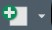

#### Types of Data{.tabset}
<details open><summary class='drop'>Getting Started</summary>
Now we're going to start coding. The best way to work through these lessons will be to take the code from this website and transfer it to an R Script in your R_training.Rprj. To start that, go to <b>File > New File > R Script</b> (the  icon will do the same), and name the script Day_1.R, and save it to your rscripts subfolder. As you get more comfortable coding in R, try pushing yourself to type the commands, rather than copying and pasting. You'll learn to code faster by typing, even if you're just mimicking what you see in the training document. 

Before we go too far, let's make sure you have the tidyverse package loaded by running the code chunk below. This is the only dependency we'll need for today's code.
```{r, c5b, echo=T, eval=F}
library(tidyverse)
```
</details>
</br>
<details open><summary class='drop'>Types of Data</summary>
<p>There are multiple types of data in R, including vectors, lists, arrays, matrices, data frames and tibbles. Vectors are the simplest data type. You can think of vectors as one column of data in an Excel spreadsheet. An example vector is below:
```{r, c6b, echo=T}
# Vector of numbers
vec_num <- c(1, 2, 3, 4, 5)
vec_num

# Vector of strings
vec_str <- c("Schoodic", "MDI-East", "MDI-West", "IAH")
vec_str
vec_str[1]
```
Note the use of <b>c()</b>. The c() function stands for combine, and it combines the elements in a list that are separated by commas. The c() function is a fairly universal way to combine multiple elements in R, and you're going to see it over and over.  

Data frames are essentially a collection of vectors of the same length. We will spend most of our time with data frames, and won't worry too much about the other data types. Tibbles are the tidyverse version of a data frame, but they're essentially the same thing as a data frame with a few added bells and whistles. 

Data frames are typically organized with rows being records or observations, and columns being variables (also called tidy data). Data frames are rectangular, meaning that every column has the same number of rows. The column variables can be numbers, text, or logical (TRUE/FALSE). Before we go any further, let's create a simple data frame to look at and perform some basic functions. </p>

Note that I have a tendency to use field (MS Access calls columns fields) and column interchangeably. Hopefully that doesn't cause confusion. Just remember that field and column are equivalent. 

<p class="code">Copy the code below into the console and run it.</p>
```{r, c7, echo=T}

df <- data.frame(plot = c(1, 2, 3, 4, 5, 6, 'plot7'), #column for plot number
                 numtrees = c(24, 18, 17, 14, 31, 27, 15), 
                 numLive = c(21, 18, 16, 10, 29, 26, 14),
                 domSpp = c('red_maple', 'red_spruce', 
                            'red_spruce','white_cedar','white_pine',
                            'white_spruce', NA),
                 invasive_pres = c(TRUE, FALSE, FALSE, FALSE, FALSE, TRUE, FALSE))

print(df)
```

Here we're creating a data frame object named <b>df</b> and using <b> <- </b> to assign the stuff on the right to <b>df</b>. The df data frame has 5 columns and 6 rows. You should notice that after you ran the code, df showed up in your Environment at the top right and the console printed output below. 

Similar to Excel, R treats numbers and text differently. Some functions will only work with numbers, and some will only work with text. A couple of points about working with different column types in R data frames:
<ul>
<li>R calls text a string. If you have any text in a column, R automatically makes it a string. </li>
<li>There are 2 types of strings in R: character (abbreviated chr) and factor. </li>
<li>Older versions of R (i.e., R < 4.x) defaulted strings to factors. The newest R version defaults to characters, which saves us a lot of headaches (more on this later). </li>
<li>When you're dealing with strings, you typically have to put quotes around them. Note that 99% of the time, it doesn't matter whether you use single or double quotes, as long as the thing you're quoting is consistent.</li>
<li>The pound sign (#) is used to tell R not to run the text following the #. This is also called commenting out text, and is a way to leave comments that won't break your code.</li>
<li>Columns that are entirely numbers (blanks are okay too) are set to numeric by default. </li>
<li>Integers are numeric whole numbers that will only return integers (no decimal points). That's usually not a problem, but if it ever becomes a problem, the as.numeric() function fixes it.</li> 
<li>Logical is the last data type, and only consists of TRUE and FALSE.</li>
<li>Finally NA is a blank or missing value in your data. Note that the last row in domSpp is NA (stands for not available).</li></ul>  
</details>
</br>
<details open><summary class='drop'>Selecting rows and columns in R</summary>
There are 2 main approaches in base R for selecting/working with rows and columns: $ and [ , ]. 
<ul>
  <li> The \$ is used to specify a data frame name and one of its columns. For example df$plot is referring to the plot column in the df data frame.</li>
  <li> The brackets [ , ] allow you to select columns and rows. The left side of the comma in brackets handles rows, and the right side of the bracket
  deals with columns, like: df[row numbers, column numbers]. </li>
</ul> 

<p class='code'>To better understand this, run the code below:</p>
```{r, c8, echo=T, eval=F}
df$plot # List the values within the column plot for the df data frame
df[ , 'plot'] # Bracket version of the same thing
df[ , 1] # Bracket version of showing the first column, which is plot
df[2, 1] # Selecting 2nd row of 1st column

```

<p class='ques'>Question 1: How do you find the value of the 3rd row of domSpp? Answer is in the Answers tab.</p>
</details>
</br>
<details open><summary class='drop'>Check and fix data structure</summary>
<p class='code'>To check the structure of your data, run the code chunk below.</p>
```{r, c9, echo=T}
str(df) # to view how R is defining each column type
head(df) # to view the first 6 rows of df
tail(df) # to view last 6 rows of df
names(df) # to view the column names and their order
```

Note the different data types in df. The plot column is called a chr, and not a number because of the last value. There's also a blank in domSpp. Let's modify the dataset so that plot reads in as numeric, and replace the missing value in domSpp with "white spruce". 

<p class='code'>Copy (or type) each section of code below and run in your console.</p>
```{r, c10, echo=T}
# The long way (note that I renamed the object here)
df2 <- data.frame(plot = c(1, 2, 3, 4, 5, 6, 'plot7'), #column for plot number
                 numtrees = c(24, 18, 17, 14, 31, 27, 15), 
                 numLive = c(21, 18, 16, 10, 29, 26, 14),
                 domSpp = c('red_maple', 'red_spruce', 
                            'red_spruce','white_cedar','white_pine',
                            'white_spruce', 'white_spruce'),
                 invasive_pres = c(TRUE, FALSE, FALSE, FALSE, FALSE, TRUE, FALSE))

# A shorter way
df$plot[7] <- 7 #takes the 7th row of the plot column and changes it to 7
df$domSpp[7] <- "white_spruce" #takes the 7th row of domSpp and replaces it with "white_spruce"

# Another shorter way
df[7, c("plot")] <- 7 #takes the 7th row of the plot column and makes it 7
df[7, c('domSpp')] <- "white_spruce" #takes the 7th row of the domSpp column and makes it "white_spruce"

# Another shorter way
df[7, 1] <- 7 #takes the 7th row of the first column and makes it 7
df[7, 4] <- "white_spruce" #takes the 7th row of the 4th column and makes it "white_spruce"

# Even shorter-way
df[7, c(1, 4)] <- c(7, "white_spruce") #Takes the 7th row and the first and 4th column, which happen to be plot and domSpp.
# Then the first column gets 7, and the 4th gets "white spruce"
```

This is merely to show that there are usually 5 different ways to do something in R, and the best way is the one you can get to work. At least that's my philosophy for most of the coding I do. Having code I can pick up a year later and still understand what it does is also important. I only really care about coding for performance if I'm working with big datasets, where slow processes can really add up.

I should mention that when you use numbers instead of column names, your code is pretty fragile to changes in column order (eg, you drop a column). Row numbers are similarly fragile, if you reorder your data. It's better to use names where possible and to use functions that use logic to find and replace records. For example:
```{r, c11, echo=T, results='hide'}

df[is.na("domSpp")] <- "white_oak"
```
Here R is looking for a value in the domSpp column that is NA (R's way of calling it a blank value). Since there's only 1, this works. If there were more than 1 NA, we'd need better logic to assign the proper value to each blank. We'll go into more detail about this later.

And now, here's the tidyverse way to replace the blank in df's domSpp column with "white_oak":
```{r, c12}
df$domSpp <- df$domSpp %>% replace_na("white_oak")

```
We'll talk more about pipes (%>%) later, but for now, just know that it's taking the data on the left of the %>% and doing the thing on the right to it.

Finally, check whether plot is now reading in as numeric or still chr.
```{r, c13, echo=T}
str(df) #still a char
```
R still thinks plot is a char. Basically once R assigns a data type to a column, you have to manually change it if you need to. In the case here, the as.numeric function fixes the issue. If you didn't fix the last record, as.numeric would still convert the plot column to numeric, but the last value will be set to NA, and you'll get a warning message: "NAs introduced by coercion".
```{r, c14, echo=T}
df$plot <- as.numeric(df$plot)
str(df)
```

<p class='ques'>Question 2: How would you make numtrees an integer? </p>

<p class='ques'>Question 3: How would you change the second row in invasive_pres from FALSE to TRUE? </p>
</details>
</br>

<hr>