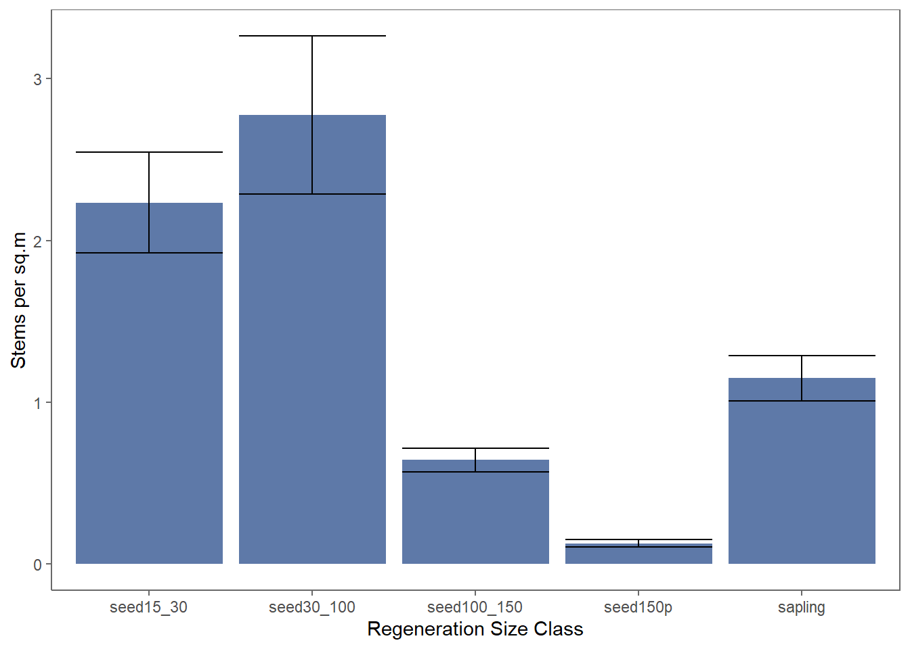

#### Plotting with ggplot2{.tabset}
<details open><summary class='drop'>Intro to ggplot</summary>
To get started with ggplot2, we need to make a dataset to plot. Instead of starting with a dataset that's ready to be plotted, let's use what we've learned to make a real dataset from NETN forest data. We're going to create the plot below that shows the mean density of seedlings and saplings by size class for the most recent 4-years of sampling at ACAD. 



Note this is also a demonstration of how building packages for your own programs can really save you time performing tasks that you're likely to do over and over.

First you need to load the forestNETN package and import the data.
```{r, c66, echo=T, results='hide'}
library(forestNETN)
library(tidyverse)
importCSV("./data/NETN_forest_csvs")
```

Now we'll use one of the functions in the forestNETN package to pull together the regeneration data. The resulting dataset will have a row for every species of tree seedling or sapling found in a given plot from 2016-2019. We'll use that dataset to sum up the total number of seedlings and saplings by size class for each plot. 

```{r c66b, echo=T, results = 'hide'}
acad_regen <- joinRegenData(park = "ACAD", from = 2016, to = 2019, canopyForm = "canopy")

head(acad_regen) # this dataframe includes species, so there are multiple rows per plot. 

# We need to group_by Plot_Name, and sum seedling densities to get plot-level seedling densities.
acad_regen2 <- acad_regen %>% group_by(Plot_Name) %>% 
                              summarize(seed15_30 = sum(seed15.30),
                                        seed30_100 = sum(seed30.100),
                                        seed100_150 = sum(seed100.150),
                                        seed150p = sum(seed150p),
                                        sapling = sum(sap.den),
                                        .groups = 'drop') %>% 
                              arrange(Plot_Name)

# This is the shortest way to get a dataset that has a mean seedling density for each size class and a se for each size class. 
# Note we want to make this long, so every plot has each of the size classes
acad_regen_long <- acad_regen2 %>% pivot_longer(-Plot_Name, names_to = "size_class", values_to = "density")

# Now we calculate the mean and se for each size class at the park level
acad_stats <- acad_regen_long %>% group_by(size_class) %>% 
                                  summarize(mean_dens = mean(density),
                                            se_dens = sd(density)/sqrt(n()),
                                            .groups = 'drop')
# We have our dataset to plot. 
```

The pros with using ggplot are that you can get a plot with very little work. The cons are that as soon as you want to change something, like removing the grid lines, customizing a legend, changing the font size, etc., it's quite tedious to do. Using the default formatting that comes with ggplot, let's plot the acad_stats dataset.

The first step in ggplot is to specify the data and the x and y (and grouping, if you have any) values with the ggplot() function.
After you set that up, you have to decide what kind of plot you want to us. The most common ones I use are:
<ul>
<li><b>geom_bar</b> is a bar chart </li>
<li><b>geom_point</b> plots points </li>
<li><b>geom_line</b> plots lines </li>
<li><b>geom_boxplot</b> is for boxplots </li>
<li><b>geom_errorbar</b> is a bar chart </li>

</ul>

As long as the mapping is the same (eg x/y values fit on the plot), you can add multiple geoms, such as points and lines that connect the points, or geom_errorbar to the geom_bar. You can even include different datasets. Just know that the ranges of the x and y axis default to the x and y you set in ggplot(). You can manually change the range of an axis to fix that, but it requires more tinkering. You can also keep adding things to the object with +.

```{r,c67, echo=T}
acad_base <- ggplot(data = acad_stats, aes(x = size_class, y = mean_dens))

# Make a point plot
acad_base + geom_point()

# Make a bar chart
acad_bar <- acad_base + geom_bar(stat = 'identity')
acad_bar

# Add error bars to the previous bar chart
acad_bar + geom_errorbar(aes(ymin = mean_dens - se_dens, ymax = mean_dens + se_dens))+
           labs(x = "Regeneration Size Class", y = "Stems per sq.m")

```

Note that the x-axis plots the size classes alphabetically instead of from small to big size classes. To fix this (this is where ggplot starts to get fiddly), we want to make the size_class column an ordered factor, and we set the order the levels. 
```{r, c68,echo=T}
acad_stats$size_class_fact <- ordered(acad_stats$size_class, 
                                      levels = c('seed15_30', 'seed30_100', 'seed100_150', 'seed150p', 'sapling'))

acad_bar2 <- ggplot(data = acad_stats, aes(x = size_class_fact, y = mean_dens))+
             geom_bar(stat = 'identity')+ 
             geom_errorbar(aes(ymin = mean_dens - se_dens, ymax = mean_dens + se_dens))+
             labs(x = "Regeneration Size Class", y = "Stems per sq.m")

acad_bar2
```

That's more like it, but I still don't like how the figure looks. For example, I don't like the gridlines in the figure. Those settings are buried in theme(), and to change it you need to +theme(change_settings_here)

```{r,c69, echo=T}

acad_bar2 + theme(panel.grid.minor = element_blank(),
                  panel.grid.major = element_blank())
```

That's a little better, but I still don't like it. And, I never remember exactly what I need to type to remove the gridlines, take the grey fill off the background, etc. So I made my own theme that does all of that in the forestNETN package, called theme_FHM.

```{r, c70, echo=T}
acad_bar2+theme_FHM()
```

Much better! But, I still prefer the bars be a different color than grey. Let's fill the bars with a nice blue color. I'll start over on the code too, so you can see it all together. Note the use of "#5E79A8" to the fill bar color. I used the hex code for a blue-grey color I like. Hex codes are a universal color code that specify the intensity of red, green, blue, and makes it easier to use the same color across multiple programs. If you want to pick your own color, you can use <a href="htmlcolorcodes.com">HTML Color Codes</a> website to pick a color and see the code. I also like the color picker, mixer and shades in <a href="https://www.w3schools.com/colors/">w3schools.com</a>. 

```{r, c71, echo=T}

acad_final <- ggplot(data = acad_stats, aes(x = size_class_fact, y = mean_dens))+
              geom_bar(stat = 'identity', fill = "#5E79A8")+
              geom_errorbar(aes(ymin = mean_dens - se_dens, ymax = mean_dens + se_dens))+
              labs(x = "Regeneration Size Class", y = "Stems per sq.m")+
              theme_FHM()

acad_final
```

<p class='ques'>Question 4: Take the acad_final graph and make 2 more changes to it. For example, make the line width on the error bars bigger, change the font size of the axis text bigger, tilt the x-axis labels (eg seed15_30) 45 degrees, rename x-axis labels, etc.</p>

</details>
<br>
<details open><summary class='drop'>More advanced plotting in ggplot</summary>
Another great feature of ggplot is that you can use grouping variables to code by color or shape, and quickly create multiple panels of plots using facet_wrap() or facet_grid(). For this section, let's work with some water data from Acadia. We'll need to load the NCRNWater package and data first. Data files are pretty big, so it might take a minute or two to load.

```{r, c71b, echo=T}
library(NCRNWater)

netnwd<-importNCRNWater(Dir = "./data/NETN_water_data", 
                        Data = "Water Data.csv", 
                        MetaData = "VizMetaData.csv")
```

You should see an object in your global environment called netnwd. All of the water data are stored within this object, and we'll use getter functions in the water package to retrieve it. This is a different work flow than we've seen up until now. Hopefully it's straightforward enough that you can get to the final dataset for plotting, which will have one row for every pH measurement taken in each ACAD annually sampled lake. The columns will contain the measurement and information about the site/sample.

To find the lakes that have been sampled every year, we have to find all of the site codes in ACAD and filter to only include Lakes. Then we need to find the sites that are sampled every year using the frequency of measurements in the dataset to determine those sites. 

```{r, c71c, echo=T}
# Create data frame that lists the sites and their type using the getSiteInfo getter.
acad_all_sites <- data.frame(sitecode = getSiteInfo(netnwd, parkcode = "ACAD", info = "SiteCode"),
                             type = getSiteInfo(netnwd, parkcode = "ACAD", info = "type"),
                             fullname = getSiteInfo(netnwd, parkcode = "ACAD", info = "SiteName"))
head(acad_all_sites)

# Filter data frame to only include lakes
acad_lakes <- acad_all_sites %>% filter(type == "Lake")  #list of site codes and full names for ACAD lakes
acad_lakes

# Compile the water pH data using getWData function
acad_ph <- getWData(netnwd, parkcode = "ACAD", years = 2006:2019, charname = 'pH')

# Filter water data to only include lakes
acad_lakes_ph <- acad_ph %>% filter(Site %in% acad_lakes$sitecode)
table(acad_lakes_ph$Site) # 8 sites with >90 measurements

# Turn the table above into a dataframe, and use it to filter the water data on.
annual_lakes <- data.frame(table(acad_lakes_ph$Site)) %>% filter(Freq > 90) 

# Filter acad_lakes_pH to only include the annual lakes and add column for month and year
acad_ph2 <- acad_lakes_ph %>% filter(Site %in% annual_lakes$Var1) %>% 
                              mutate(month = format(Date, "%m"),
                                     year = format(Date, "%Y"))
head(acad_ph2)
acad_ph_final <- left_join(acad_ph2, acad_lakes[, c("sitecode", "fullname")], 
                           by= c("Site" = "sitecode")) # how to join if columns have diff. names

head(acad_ph_final) #final dataset to plot

```

Now that we have our final dataset, let's first create a plot that color codes points and lines by site.

```{r, c71d, echo=T}
ph_plot <- ggplot(acad_ph_final, aes(x = Date, y = Value, color = Site, shape = Site))+
           geom_point()+ 
           labs(y = "pH")+
           theme_bw()
ph_plot
```

There's too much going on here to make sense of the data. Let's split the data so that each site has its own plot.

```{r, c71f, echo=T}
ph_plot_site <- ggplot(acad_ph_final, aes(x = Date, y = Value))+
                geom_point(shape = 16, color = "LightBlue")+ 
                labs(y = "pH")+
                theme_bw()+
                facet_wrap(~fullname)
ph_plot_site
```

Now let's add a loess smoother to explore trends. The great thing about ggplot is that you can keep adding to existing plots without having to repeat code.

```{r, c71e, echo=T}
ph_plot_site_smooth <- ph_plot_site + geom_smooth(method = 'loess', span = 1, color = "RoyalBlue", se = FALSE)

# vary the span to increase/decrease wavyness of smooth
ph_plot_site_smooth + geom_smooth(method = 'loess', span = 0.1, color = "red", se = FALSE)+
                      geom_smooth(method = 'loess', span = 0.5, color = 'green', se = FALSE)      

```
Now let's change the years so they're at an angle and include every 3 years. 
```{r, c71g, echo=T}
ph_plot_site <- ggplot(acad_ph_final, aes(x = Date, y = Value))+
                geom_point(shape = 16, color = "LightBlue")+ 
                labs(y = "pH")+
                theme_bw()+
                facet_wrap(~fullname)+
                geom_smooth(method = 'loess', span = 0.5, color = 'RoyalBlue', se = FALSE)

ph_plot_site2 <- ph_plot_site + scale_x_date(date_breaks = "2 years",
                                             date_labels = "%Y")+
                                theme(axis.text.x = element_text(angle = 45, hjust = 1))

ph_plot_site2
```

I'm just barely scratching the surface of what you can do in ggplot2. For more examples of the types of graphs you can make, check out the <a href="https://www.r-graph-gallery.com/ggplot2-package.html"> R ggplot gallery</a>. 

<p class='ques'>Question 5: Filter the acad_ph_final data frame to only include 2019 data and create a plot with months as the X axis, and includes points, a loess smooth with span = 1, and a facet on site. </p>

</details>

<br>
<hr>